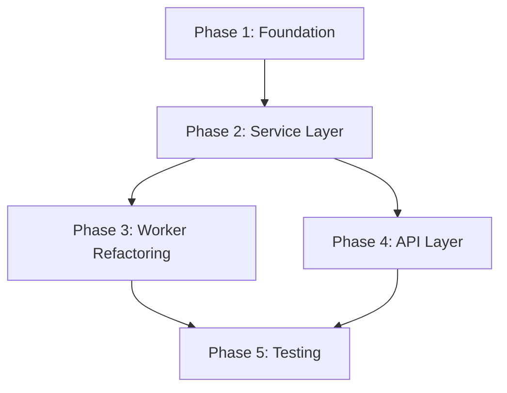

# UNI-VIDEO SOLID REFACTORING PLAN

**Ngày tạo:** 2026-01-12
**Trạng thái:** 🔴 Chưa bắt đầu
**Thời gian ước tính:** 4-6 tuần
**Mức độ ưu tiên:** HIGH

---

## 📋 MỤC LỤC

1. [Tổng quan](#tổng-quan)
2. [Phân tích vi phạm SOLID](#phân-tích-vi-phạm-solid)
3. [Roadmap thực hiện](#roadmap-thực-hiện)
4. [Phase 1: Foundation Layer](#phase-1-foundation-layer)
5. [Phase 2: Service Layer](#phase-2-service-layer)
6. [Phase 3: Worker Refactoring](#phase-3-worker-refactoring)
7. [Phase 4: API Layer](#phase-4-api-layer)
8. [Phase 5: Testing & Optimization](#phase-5-testing--optimization)
9. [Checklist tổng hợp](#checklist-tổng-hợp)

---

## 📊 TỔNG QUAN

### Vấn đề hiện tại

Codebase Uni-Video back-end vi phạm nghiêm trọng các nguyên tắc SOLID:

| Nguyên tắc | Mức độ vi phạm | Files chính bị ảnh hưởng |
|------------|----------------|--------------------------|
| **SRP** (Single Responsibility) | ❌❌❌ Nghiêm trọng | `endpoints.py` (1237 dòng), `worker_v2.py` (1448 dòng) |
| **DIP** (Dependency Inversion) | ❌❌❌ Nghiêm trọng | Toàn bộ worker, endpoints |
| **ISP** (Interface Segregation) | ❌❌ Đáng kể | `models.py`, `endpoints.py` |
| **OCP** (Open/Closed) | ⚠️ Vừa phải | `task_manager.py`, `account_manager.py` |
| **LSP** (Liskov Substitution) | ⚠️ Vừa phải | `drivers/base.py` |

### Lợi ích sau khi refactor

- ✅ **Dễ test** (mock dependencies, unit test từng layer)
- ✅ **Dễ maintain** (mỗi class một trách nhiệm rõ ràng)
- ✅ **Dễ mở rộng** (thêm platform mới, task type mới)
- ✅ **Giảm coupling** (thay đổi implementation không ảnh hưởng toàn hệ thống)
- ✅ **Code cleaner** (files nhỏ hơn, dễ đọc, dễ review)

### Cấu trúc mục tiêu

```
app/
├── api/
│   ├── dependencies.py          # FastAPI dependencies
│   └── routers/
│       ├── __init__.py
│       ├── accounts.py          # Account endpoints
│       ├── jobs.py              # Job endpoints
│       ├── system.py            # System endpoints
│       ├── license.py           # License endpoints
│       ├── files.py             # File upload endpoints
│       └── websocket.py         # WebSocket endpoints
│
├── core/
│   ├── domain/                  # Domain models (value objects)
│   │   ├── __init__.py
│   │   ├── account.py           # Account domain models
│   │   ├── job.py               # Job domain models
│   │   └── task.py              # Task domain models
│   │
│   ├── repositories/            # Repository pattern
│   │   ├── __init__.py
│   │   ├── base.py              # Base repository
│   │   ├── account_repo.py      # Account repository
│   │   └── job_repo.py          # Job repository
│   │
│   ├── services/                # Business logic
│   │   ├── __init__.py
│   │   ├── account_service.py   # Account business logic
│   │   ├── job_service.py       # Job business logic
│   │   └── task_service.py      # Task orchestration
│   │
│   ├── workers/                 # Worker classes
│   │   ├── __init__.py
│   │   ├── base.py              # Base worker
│   │   ├── generate_worker.py   # Generate worker
│   │   ├── poll_worker.py       # Poll worker
│   │   ├── download_worker.py   # Download worker
│   │   └── job_monitor.py       # Stale job monitor
│   │
│   ├── strategies/              # Strategy pattern
│   │   ├── __init__.py
│   │   ├── task_processor.py    # Task processing strategies
│   │   ├── account_selector.py  # Account selection strategies
│   │   └── retry_policy.py      # Retry strategies
│   │
│   ├── drivers/
│   │   ├── __init__.py
│   │   ├── base.py              # Abstract driver (đầy đủ interface)
│   │   ├── factory.py           # Driver factory
│   │   ├── sora/
│   │   │   ├── driver.py
│   │   │   └── ...
│   │   └── veo3/
│   │       └── driver.py
│   │
│   ├── task_manager.py          # Task manager (refactored)
│   ├── account_manager.py       # Account manager (refactored)
│   └── container.py             # DI container
│
├── models.py                    # SQLAlchemy models (giữ nguyên)
├── database.py                  # Database config
└── main.py                      # FastAPI app
```

---

## 🔍 PHÂN TÍCH VI PHẠM SOLID

### 1. SRP (Single Responsibility Principle)

#### ❌ Vi phạm: `endpoints.py` (1237 dòng)

**Trách nhiệm hiện tại:**
- Account CRUD (create, read, delete) - dòng 31-233
- Account login (manual, global) - dòng 236-399
- Account refresh/check credits - dòng 407-691
- Job CRUD - dòng 696-779
- Job actions (cancel, retry, bulk) - dòng 782-1099
- System management (reset, pause, resume) - dòng 1102-1159
- File upload - dòng 873-896
- OS integration (open folder/video) - dòng 1166-1216
- License management - dòng 817-843
- WebSocket logs - dòng 847-870

**Vấn đề:**
- Một file quá lớn, khó maintain
- Mixing nhiều concerns khác nhau
- Khó test từng phần riêng lẻ

#### ❌ Vi phạm: `worker_v2.py` (1448 dòng)

**Trách nhiệm hiện tại:**
- Generate task processing - dòng 75-775
- Poll task processing - dòng 975-1248
- Download task processing - dòng 1250-1389
- Stale job monitoring - dòng 777-885
- Queue hydration - dòng 887-946
- Account switching logic - xen kẽ nhiều nơi
- Rate limiting logic - xen kẽ nhiều nơi

**Vấn đề:**
- Một file quá lớn (1448 dòng)
- Logic xử lý 3 loại task khác nhau trong cùng file
- Khó maintain và debug

#### ❌ Vi phạm: `account_manager.py` (162 dòng)

**Trách nhiệm hiện tại:**
- Account selection logic
- Busy state management
- Rate limiting
- Lock management

**Vấn đề:**
- Mixing nhiều concerns: selection + state + rate limit + locking

### 2. DIP (Dependency Inversion Principle)

#### ❌ Vi phạm: Worker → Database

```python
# worker_v2.py:8,247
from .. import models
job = db.query(models.Job).filter(...).first()  # Tight coupling!
```

**Vấn đề:**
- Worker (high-level) phụ thuộc trực tiếp vào SQLAlchemy models (low-level)
- Không thể swap database implementation
- Khó test (phải mock toàn bộ SQLAlchemy)

#### ❌ Vi phạm: Endpoints → Worker

```python
# endpoints.py:900
from ..core.task_manager import task_manager
await task_manager.start_job(job)  # Direct dependency!
```

**Vấn đề:**
- Endpoints phụ thuộc trực tiếp vào task_manager implementation
- Không có abstraction layer

#### ❌ Vi phạm: Global Singleton

```python
# task_manager.py:565
task_manager = SimpleTaskManager()  # Global singleton!

# Mọi nơi import:
from app.core.task_manager import task_manager
```

**Vấn đề:**
- Tight coupling
- Khó test (không thể inject mock)
- Không thể có multiple instances

### 3. ISP (Interface Segregation Principle)

#### ❌ Vi phạm: Account Model (16 fields)

```python
class Account(Base):
    # Authentication (3 fields)
    email, password, login_mode

    # Session (6 fields)
    cookies, access_token, user_agent, device_id,
    token_status, token_captured_at, token_expires_at

    # Credits (3 fields)
    credits_remaining, credits_last_checked, credits_reset_at

    # Usage (4 fields)
    platform, last_used, proxy, jobs (relationship)
```

**Vấn đề:**
- Code chỉ cần check credits phải load toàn bộ Account với 16 fields
- Fat model

#### ❌ Vi phạm: Job Model (14 fields)

**Vấn đề tương tự Account model**

### 4. OCP (Open/Closed Principle)

#### ❌ Vi phạm: Hardcode task types

```python
# task_manager.py:33
task_type: str  # "generate" | "download" | "verify"  ← Hardcode!
```

**Vấn đề:**
- Muốn thêm task type mới phải sửa nhiều nơi

#### ❌ Vi phạm: Hardcode account selection

```python
# account_manager.py:61-99
def get_available_account(...):
    # Hardcode logic: credits, busy, rate limit, LRU
```

**Vấn đề:**
- Muốn thêm tiêu chí mới phải sửa function

### 5. LSP (Liskov Substitution Principle)

#### ❌ Vi phạm: BaseDriver không đủ interface

```python
# BaseDriver chỉ có: start(), stop(), save_storage_state()
# SoraDriver có thêm: api_only(), generate_video_api(), get_credits_api(), ...
```

**Vấn đề:**
- Code phụ thuộc vào SoraDriver-specific methods
- Không thể substitute bằng BaseDriver

---

## 🗺️ ROADMAP THỰC HIỆN

### Timeline tổng quan

```
Week 1-2: Phase 1 (Foundation Layer)
Week 2-3: Phase 2 (Service Layer)
Week 3-4: Phase 3 (Worker Refactoring)
Week 4-5: Phase 4 (API Layer)
Week 5-6: Phase 5 (Testing & Optimization)
```

### Dependencies giữa các phases



---

## 🏗️ PHASE 1: FOUNDATION LAYER

**Thời gian:** 1-2 tuần
**Trạng thái:** 🔴 Chưa bắt đầu
**Mức độ ưu tiên:** 🔥 CRITICAL

### Mục tiêu

Tạo foundation layer với:
- Domain models (value objects)
- Repository pattern
- Base abstractions
- Dependency Injection container

### Tasks

#### 1.1. Tạo Domain Models ✅

**File:** `app/core/domain/account.py`

```python
from dataclasses import dataclass
from typing import Optional
from datetime import datetime

@dataclass(frozen=True)
class AccountId:
    """Value object cho Account ID"""
    value: int

    def __post_init__(self):
        if self.value <= 0:
            raise ValueError("Account ID must be positive")

@dataclass(frozen=True)
class AccountAuth:
    """Domain model cho authentication"""
    id: AccountId
    email: str
    password: str
    login_mode: str  # "auto" | "manual"

@dataclass(frozen=True)
class AccountSession:
    """Domain model cho session data"""
    id: AccountId
    cookies: Optional[dict]
    access_token: Optional[str]
    device_id: Optional[str]
    user_agent: Optional[str]
    token_status: str  # "pending" | "valid" | "expired"
    token_captured_at: Optional[datetime] = None
    token_expires_at: Optional[datetime] = None

@dataclass(frozen=True)
class AccountCredits:
    """Domain model cho credits tracking"""
    id: AccountId
    credits_remaining: Optional[int]
    credits_last_checked: Optional[datetime]
    credits_reset_at: Optional[datetime]

    def has_credits(self) -> bool:
        """Check if account has available credits"""
        return self.credits_remaining is None or self.credits_remaining > 0

@dataclass
class Account:
    """Aggregate root cho Account"""
    id: AccountId
    email: str
    platform: str
    auth: AccountAuth
    session: AccountSession
    credits: AccountCredits
    last_used: Optional[datetime] = None
    proxy: Optional[str] = None

    @staticmethod
    def from_orm(orm_account) -> 'Account':
        """Convert từ SQLAlchemy model sang domain model"""
        return Account(
            id=AccountId(orm_account.id),
            email=orm_account.email,
            platform=orm_account.platform,
            auth=AccountAuth(
                id=AccountId(orm_account.id),
                email=orm_account.email,
                password=orm_account.password,
                login_mode=orm_account.login_mode
            ),
            session=AccountSession(
                id=AccountId(orm_account.id),
                cookies=orm_account.cookies,
                access_token=orm_account.access_token,
                device_id=orm_account.device_id,
                user_agent=orm_account.user_agent,
                token_status=orm_account.token_status,
                token_captured_at=orm_account.token_captured_at,
                token_expires_at=orm_account.token_expires_at
            ),
            credits=AccountCredits(
                id=AccountId(orm_account.id),
                credits_remaining=orm_account.credits_remaining,
                credits_last_checked=orm_account.credits_last_checked,
                credits_reset_at=orm_account.credits_reset_at
            ),
            last_used=orm_account.last_used,
            proxy=orm_account.proxy
        )
```

**File:** `app/core/domain/job.py`

```python
from dataclasses import dataclass, field
from typing import Optional
from datetime import datetime
from enum import Enum

class JobStatus(str, Enum):
    """Job status enum"""
    DRAFT = "draft"
    PENDING = "pending"
    PROCESSING = "processing"
    SENT_PROMPT = "sent_prompt"
    GENERATING = "generating"
    DOWNLOAD = "download"
    COMPLETED = "completed"
    DONE = "done"
    FAILED = "failed"
    CANCELLED = "cancelled"

@dataclass(frozen=True)
class JobId:
    """Value object cho Job ID"""
    value: int

@dataclass(frozen=True)
class JobSpec:
    """Job specification - immutable"""
    prompt: str
    image_path: Optional[str]
    duration: int  # seconds
    aspect_ratio: str  # "16:9", "9:16", "1:1"

    def __post_init__(self):
        if not self.prompt:
            raise ValueError("Prompt cannot be empty")
        if self.duration not in [5, 10, 15]:
            raise ValueError("Duration must be 5, 10, or 15 seconds")

@dataclass
class JobProgress:
    """Job progress tracking"""
    status: JobStatus
    progress: int  # 0-100
    error_message: Optional[str] = None
    retry_count: int = 0
    max_retries: int = 3

    def can_retry(self) -> bool:
        """Check if job can be retried"""
        return self.retry_count < self.max_retries

@dataclass
class JobResult:
    """Job result"""
    video_url: Optional[str] = None
    video_id: Optional[str] = None
    local_path: Optional[str] = None

    def is_complete(self) -> bool:
        """Check if job has complete result"""
        return self.local_path is not None

@dataclass
class Job:
    """Aggregate root cho Job"""
    id: JobId
    spec: JobSpec
    progress: JobProgress
    result: JobResult
    account_id: Optional[int] = None
    task_state: Optional[dict] = None
    created_at: datetime = field(default_factory=datetime.utcnow)
    updated_at: datetime = field(default_factory=datetime.utcnow)

    @staticmethod
    def from_orm(orm_job) -> 'Job':
        """Convert từ SQLAlchemy model sang domain model"""
        import json
        return Job(
            id=JobId(orm_job.id),
            spec=JobSpec(
                prompt=orm_job.prompt,
                image_path=orm_job.image_path,
                duration=orm_job.duration,
                aspect_ratio=orm_job.aspect_ratio
            ),
            progress=JobProgress(
                status=JobStatus(orm_job.status),
                progress=orm_job.progress or 0,
                error_message=orm_job.error_message,
                retry_count=orm_job.retry_count or 0,
                max_retries=orm_job.max_retries or 3
            ),
            result=JobResult(
                video_url=orm_job.video_url,
                video_id=orm_job.video_id,
                local_path=orm_job.local_path
            ),
            account_id=orm_job.account_id,
            task_state=json.loads(orm_job.task_state) if orm_job.task_state else None,
            created_at=orm_job.created_at,
            updated_at=orm_job.updated_at
        )

    def to_orm_dict(self) -> dict:
        """Convert to dict for SQLAlchemy update"""
        import json
        return {
            "prompt": self.spec.prompt,
            "image_path": self.spec.image_path,
            "duration": self.spec.duration,
            "aspect_ratio": self.spec.aspect_ratio,
            "status": self.progress.status.value,
            "progress": self.progress.progress,
            "error_message": self.progress.error_message,
            "retry_count": self.progress.retry_count,
            "max_retries": self.progress.max_retries,
            "video_url": self.result.video_url,
            "video_id": self.result.video_id,
            "local_path": self.result.local_path,
            "account_id": self.account_id,
            "task_state": json.dumps(self.task_state) if self.task_state else None,
            "updated_at": datetime.utcnow()
        }
```

**Checklist:**
- [ ] Tạo `app/core/domain/__init__.py`
- [ ] Tạo `app/core/domain/account.py` với AccountAuth, AccountSession, AccountCredits
- [ ] Tạo `app/core/domain/job.py` với JobSpec, JobProgress, JobResult
- [ ] Tạo `app/core/domain/task.py` với TaskContext domain model
- [ ] Write unit tests cho domain models
- [ ] Validate business rules trong domain models

---

#### 1.2. Implement Repository Pattern ✅

**File:** `app/core/repositories/base.py`

```python
from abc import ABC, abstractmethod
from typing import TypeVar, Generic, Optional, List
from sqlalchemy.orm import Session

T = TypeVar('T')

class BaseRepository(ABC, Generic[T]):
    """Base repository với CRUD operations cơ bản"""

    def __init__(self, session: Session):
        self.session = session

    @abstractmethod
    async def get_by_id(self, id: int) -> Optional[T]:
        """Lấy entity theo ID"""
        pass

    @abstractmethod
    async def get_all(self, skip: int = 0, limit: int = 100) -> List[T]:
        """Lấy danh sách entities"""
        pass

    @abstractmethod
    async def create(self, entity: T) -> T:
        """Tạo entity mới"""
        pass

    @abstractmethod
    async def update(self, entity: T) -> T:
        """Cập nhật entity"""
        pass

    @abstractmethod
    async def delete(self, id: int) -> bool:
        """Xóa entity"""
        pass

    def commit(self):
        """Commit transaction"""
        self.session.commit()

    def rollback(self):
        """Rollback transaction"""
        self.session.rollback()
```

**File:** `app/core/repositories/account_repo.py`

```python
from typing import Optional, List
from sqlalchemy.orm import Session
from sqlalchemy import or_
from .base import BaseRepository
from ..domain.account import Account, AccountId, AccountCredits
from ...models import Account as AccountModel

class AccountRepository(BaseRepository[Account]):
    """Repository cho Account aggregate"""

    async def get_by_id(self, id: int) -> Optional[Account]:
        """Lấy account theo ID"""
        orm_account = self.session.query(AccountModel).filter_by(id=id).first()
        return Account.from_orm(orm_account) if orm_account else None

    async def get_by_email(self, email: str) -> Optional[Account]:
        """Lấy account theo email"""
        orm_account = self.session.query(AccountModel).filter_by(email=email).first()
        return Account.from_orm(orm_account) if orm_account else None

    async def get_all(self, skip: int = 0, limit: int = 100) -> List[Account]:
        """Lấy danh sách accounts"""
        orm_accounts = (
            self.session.query(AccountModel)
            .order_by(AccountModel.id.asc())
            .offset(skip)
            .limit(limit)
            .all()
        )
        return [Account.from_orm(acc) for acc in orm_accounts]

    async def get_available_accounts(
        self,
        platform: str,
        exclude_ids: Optional[List[int]] = None
    ) -> List[Account]:
        """
        Lấy accounts available (có credits)

        Business rules:
        - credits_remaining is None OR credits_remaining > 0
        - Not in exclude_ids
        """
        query = self.session.query(AccountModel).filter(
            AccountModel.platform == platform,
            or_(
                AccountModel.credits_remaining == None,
                AccountModel.credits_remaining > 0
            )
        )

        if exclude_ids:
            query = query.filter(AccountModel.id.notin_(exclude_ids))

        orm_accounts = query.all()
        return [Account.from_orm(acc) for acc in orm_accounts]

    async def get_credits(self, account_id: int) -> Optional[AccountCredits]:
        """Chỉ lấy credits info (ISP - Interface Segregation)"""
        orm_account = self.session.query(AccountModel).filter_by(id=account_id).first()
        if not orm_account:
            return None

        return AccountCredits(
            id=AccountId(orm_account.id),
            credits_remaining=orm_account.credits_remaining,
            credits_last_checked=orm_account.credits_last_checked,
            credits_reset_at=orm_account.credits_reset_at
        )

    async def create(self, account: Account) -> Account:
        """Tạo account mới"""
        orm_account = AccountModel(
            platform=account.platform,
            email=account.email,
            password=account.auth.password,
            proxy=account.proxy,
            login_mode=account.auth.login_mode
        )
        self.session.add(orm_account)
        self.session.flush()  # Get ID
        return Account.from_orm(orm_account)

    async def update(self, account: Account) -> Account:
        """Cập nhật account"""
        orm_account = self.session.query(AccountModel).filter_by(id=account.id.value).first()
        if not orm_account:
            raise ValueError(f"Account {account.id.value} not found")

        # Update fields
        orm_account.email = account.email
        orm_account.platform = account.platform
        orm_account.password = account.auth.password
        orm_account.login_mode = account.auth.login_mode
        orm_account.cookies = account.session.cookies
        orm_account.access_token = account.session.access_token
        orm_account.device_id = account.session.device_id
        orm_account.user_agent = account.session.user_agent
        orm_account.token_status = account.session.token_status
        orm_account.token_captured_at = account.session.token_captured_at
        orm_account.token_expires_at = account.session.token_expires_at
        orm_account.credits_remaining = account.credits.credits_remaining
        orm_account.credits_last_checked = account.credits.credits_last_checked
        orm_account.credits_reset_at = account.credits.credits_reset_at
        orm_account.last_used = account.last_used
        orm_account.proxy = account.proxy

        self.session.flush()
        return Account.from_orm(orm_account)

    async def delete(self, id: int) -> bool:
        """Xóa account"""
        orm_account = self.session.query(AccountModel).filter_by(id=id).first()
        if orm_account:
            self.session.delete(orm_account)
            return True
        return False
```

**File:** `app/core/repositories/job_repo.py`

```python
from typing import Optional, List
from sqlalchemy.orm import Session
from .base import BaseRepository
from ..domain.job import Job, JobId, JobStatus
from ...models import Job as JobModel

class JobRepository(BaseRepository[Job]):
    """Repository cho Job aggregate"""

    async def get_by_id(self, id: int) -> Optional[Job]:
        """Lấy job theo ID"""
        orm_job = self.session.query(JobModel).filter_by(id=id).first()
        return Job.from_orm(orm_job) if orm_job else None

    async def get_all(
        self,
        skip: int = 0,
        limit: int = 100,
        status_filter: Optional[List[JobStatus]] = None
    ) -> List[Job]:
        """Lấy danh sách jobs với filter"""
        query = self.session.query(JobModel)

        if status_filter:
            status_values = [s.value for s in status_filter]
            query = query.filter(JobModel.status.in_(status_values))

        orm_jobs = (
            query
            .order_by(JobModel.id.desc())
            .offset(skip)
            .limit(limit)
            .all()
        )
        return [Job.from_orm(job) for job in orm_jobs]

    async def get_pending_jobs(self) -> List[Job]:
        """Lấy jobs đang pending"""
        orm_jobs = (
            self.session.query(JobModel)
            .filter(JobModel.status.in_(["pending", "download"]))
            .order_by(JobModel.created_at.asc())
            .all()
        )
        return [Job.from_orm(job) for job in orm_jobs]

    async def get_stale_jobs(self, cutoff_minutes: int = 15) -> List[Job]:
        """Lấy jobs bị stuck (stale)"""
        from datetime import datetime, timedelta
        cutoff = datetime.utcnow() - timedelta(minutes=cutoff_minutes)

        orm_jobs = (
            self.session.query(JobModel)
            .filter(
                JobModel.status.in_(["processing", "sent_prompt", "generating", "download"]),
                JobModel.updated_at < cutoff
            )
            .all()
        )
        return [Job.from_orm(job) for job in orm_jobs]

    async def create(self, job: Job) -> Job:
        """Tạo job mới"""
        orm_job = JobModel(**job.to_orm_dict())
        self.session.add(orm_job)
        self.session.flush()  # Get ID
        return Job.from_orm(orm_job)

    async def update(self, job: Job) -> Job:
        """Cập nhật job"""
        orm_job = self.session.query(JobModel).filter_by(id=job.id.value).first()
        if not orm_job:
            raise ValueError(f"Job {job.id.value} not found")

        # Update fields
        for key, value in job.to_orm_dict().items():
            setattr(orm_job, key, value)

        self.session.flush()
        return Job.from_orm(orm_job)

    async def delete(self, id: int) -> bool:
        """Xóa job"""
        orm_job = self.session.query(JobModel).filter_by(id=id).first()
        if orm_job:
            self.session.delete(orm_job)
            return True
        return False

    async def bulk_delete(self, ids: List[int]) -> int:
        """Xóa nhiều jobs"""
        count = self.session.query(JobModel).filter(JobModel.id.in_(ids)).delete(
            synchronize_session=False
        )
        return count
```

**Checklist:**
- [ ] Tạo `app/core/repositories/__init__.py`
- [ ] Tạo `app/core/repositories/base.py` với BaseRepository
- [ ] Tạo `app/core/repositories/account_repo.py`
- [ ] Tạo `app/core/repositories/job_repo.py`
- [ ] Write unit tests cho repositories (với in-memory SQLite)
- [ ] Integration tests với real database

---

#### 1.3. Tạo Dependency Injection Container ✅

**File:** `app/core/container.py`

```python
"""
Dependency Injection Container
Sử dụng dependency_injector library
"""
from dependency_injector import containers, providers
from sqlalchemy.orm import Session
from ..database import SessionLocal

# Repositories
from .repositories.account_repo import AccountRepository
from .repositories.job_repo import JobRepository

# Services (sẽ implement ở Phase 2)
# from .services.account_service import AccountService
# from .services.job_service import JobService

# Workers (sẽ implement ở Phase 3)
# from .workers.generate_worker import GenerateWorker

class Container(containers.DeclarativeContainer):
    """Main DI Container"""

    # ========== Configuration ==========
    config = providers.Configuration()

    # ========== Database ==========
    db_session = providers.Factory(SessionLocal)

    # ========== Repositories ==========
    account_repository = providers.Factory(
        AccountRepository,
        session=db_session
    )

    job_repository = providers.Factory(
        JobRepository,
        session=db_session
    )

    # ========== Services (Phase 2) ==========
    # account_service = providers.Factory(
    #     AccountService,
    #     account_repo=account_repository
    # )

    # job_service = providers.Factory(
    #     JobService,
    #     job_repo=job_repository,
    #     account_repo=account_repository
    # )

    # ========== Workers (Phase 3) ==========
    # generate_worker = providers.Factory(
    #     GenerateWorker,
    #     job_repo=job_repository,
    #     account_repo=account_repository
    # )

# Global container instance
container = Container()
```

**File:** `app/api/dependencies.py`

```python
"""
FastAPI Dependencies
Sử dụng DI container để inject dependencies vào endpoints
"""
from typing import Generator
from sqlalchemy.orm import Session
from ..core.container import container
from ..core.repositories.account_repo import AccountRepository
from ..core.repositories.job_repo import JobRepository

# ========== Database Session ==========
def get_db() -> Generator[Session, None, None]:
    """Dependency để lấy database session"""
    db = container.db_session()
    try:
        yield db
    finally:
        db.close()

# ========== Repositories ==========
def get_account_repository(db: Session = Depends(get_db)) -> AccountRepository:
    """Dependency để lấy AccountRepository"""
    return AccountRepository(db)

def get_job_repository(db: Session = Depends(get_db)) -> JobRepository:
    """Dependency để lấy JobRepository"""
    return JobRepository(db)

# ========== Services (Phase 2) ==========
# def get_account_service(
#     account_repo: AccountRepository = Depends(get_account_repository)
# ) -> AccountService:
#     return AccountService(account_repo)

# def get_job_service(
#     job_repo: JobRepository = Depends(get_job_repository),
#     account_repo: AccountRepository = Depends(get_account_repository)
# ) -> JobService:
#     return JobService(job_repo, account_repo)
```

**Checklist:**
- [ ] Install `dependency-injector` package
- [ ] Tạo `app/core/container.py` với Container
- [ ] Tạo `app/api/dependencies.py` với FastAPI dependencies
- [ ] Config container trong `main.py`
- [ ] Test DI container hoạt động đúng

---

#### 1.4. Tạo Abstract Driver Interface ✅

**File:** `app/core/drivers/base.py` (REFACTOR)

```python
from abc import ABC, abstractmethod
from typing import Optional, Dict, Any
from dataclasses import dataclass

@dataclass
class VideoResult:
    """Result từ video generation"""
    success: bool
    task_id: Optional[str] = None
    error: Optional[str] = None

@dataclass
class CreditsInfo:
    """Credits information"""
    credits: Optional[int]
    reset_seconds: Optional[int] = None
    error_code: Optional[str] = None
    error: Optional[str] = None

@dataclass
class UploadResult:
    """Result từ image upload"""
    success: bool
    file_id: Optional[str] = None
    error: Optional[str] = None

@dataclass
class VideoData:
    """Video data khi hoàn thành"""
    id: str
    download_url: str
    status: str
    progress_pct: Optional[float] = None

class VideoGenerationDriver(ABC):
    """
    Abstract base class cho video generation drivers
    Implements: Liskov Substitution Principle (LSP)
    """

    @abstractmethod
    async def start(self) -> None:
        """Start driver (initialize browser/API client)"""
        pass

    @abstractmethod
    async def stop(self) -> None:
        """Stop driver and cleanup resources"""
        pass

    @abstractmethod
    async def generate_video(
        self,
        prompt: str,
        duration: int,
        aspect_ratio: str,
        image_path: Optional[str] = None
    ) -> VideoResult:
        """
        Generate video

        Args:
            prompt: Text prompt
            duration: Duration in seconds
            aspect_ratio: Aspect ratio ("16:9", "9:16", "1:1")
            image_path: Optional image path

        Returns:
            VideoResult with task_id
        """
        pass

    @abstractmethod
    async def get_credits(self) -> CreditsInfo:
        """Get credits information"""
        pass

    @abstractmethod
    async def upload_image(self, image_path: str) -> UploadResult:
        """Upload image for video generation"""
        pass

    @abstractmethod
    async def wait_for_completion(
        self,
        task_id: str,
        timeout: int = 300
    ) -> Optional[VideoData]:
        """
        Wait for video generation to complete

        Args:
            task_id: Task ID to wait for
            timeout: Max wait time in seconds

        Returns:
            VideoData when complete, None if timeout
        """
        pass

    @abstractmethod
    async def get_pending_tasks(self) -> list[Dict[str, Any]]:
        """Get list of pending generation tasks"""
        pass

class BrowserBasedDriver(VideoGenerationDriver):
    """Base class cho drivers sử dụng browser automation"""

    def __init__(
        self,
        headless: bool = True,
        proxy: Optional[str] = None,
        user_data_dir: Optional[str] = None,
        channel: str = "chrome"
    ):
        self.headless = headless
        self.proxy = proxy
        self.user_data_dir = user_data_dir
        self.channel = channel
        self.playwright = None
        self.browser = None
        self.context = None
        self.page = None

class APIOnlyDriver(VideoGenerationDriver):
    """Base class cho drivers chỉ sử dụng API (no browser)"""

    def __init__(
        self,
        access_token: str,
        device_id: Optional[str] = None,
        user_agent: Optional[str] = None
    ):
        self.access_token = access_token
        self.device_id = device_id
        self.user_agent = user_agent or "Mozilla/5.0"
```

**File:** `app/core/drivers/factory.py`

```python
"""
Driver Factory
Implements: Open/Closed Principle (OCP)
"""
from typing import Dict, Type
from .base import VideoGenerationDriver
from .sora.driver import SoraDriver
# from .veo3.driver import VEO3Driver  # Future

class DriverFactory:
    """Factory để tạo driver phù hợp"""

    def __init__(self):
        self._drivers: Dict[str, Type[VideoGenerationDriver]] = {}
        # Register drivers
        self.register("sora", SoraDriver)
        # self.register("veo3", VEO3Driver)  # Future

    def register(self, platform: str, driver_class: Type[VideoGenerationDriver]):
        """Register driver class cho platform"""
        self._drivers[platform] = driver_class

    def create_driver(
        self,
        platform: str,
        **kwargs
    ) -> VideoGenerationDriver:
        """
        Create driver instance

        Args:
            platform: Platform name ("sora", "veo3", ...)
            **kwargs: Driver-specific kwargs

        Returns:
            VideoGenerationDriver instance
        """
        driver_class = self._drivers.get(platform)
        if not driver_class:
            raise ValueError(f"Unknown platform: {platform}")

        return driver_class(**kwargs)

# Global factory instance
driver_factory = DriverFactory()
```

**Checklist:**
- [ ] Refactor `app/core/drivers/base.py` với full interface
- [ ] Tạo `app/core/drivers/factory.py`
- [ ] Update `SoraDriver` để implement full interface
- [ ] Test LSP: có thể swap drivers

---

### Phase 1 Summary

**Hoàn thành Phase 1 khi:**
- [ ] Domain models được tạo và tested
- [ ] Repository pattern được implement
- [ ] DI container hoạt động
- [ ] Abstract driver interface đầy đủ
- [ ] Tests pass (unit + integration)

**Chuyển sang Phase 2 khi:** ✅ All checkboxes above checked

---

## 🎯 PHASE 2: SERVICE LAYER

**Thời gian:** 1 tuần
**Trạng thái:** 🔴 Chưa bắt đầu
**Mức độ ưu tiên:** 🔥 HIGH

### Mục tiêu

Tạo Service Layer để:
- Tách business logic khỏi endpoints và workers
- Implement Use Cases
- Coordinate giữa repositories và external services

### Tasks

#### 2.1. Account Service ✅

**File:** `app/core/services/account_service.py`

```python
"""
Account Service - Business logic cho Account management
Implements: Single Responsibility Principle (SRP)
"""
from typing import Optional, List
from ..repositories.account_repo import AccountRepository
from ..domain.account import Account, AccountCredits
from ..drivers.factory import DriverFactory
import logging

logger = logging.getLogger(__name__)

class AccountService:
    """Service xử lý account business logic"""

    def __init__(
        self,
        account_repo: AccountRepository,
        driver_factory: DriverFactory
    ):
        self.account_repo = account_repo
        self.driver_factory = driver_factory

    async def create_account(
        self,
        platform: str,
        email: str,
        password: str,
        proxy: Optional[str] = None
    ) -> Account:
        """Create new account"""
        # Business rule: Email must be unique
        existing = await self.account_repo.get_by_email(email)
        if existing:
            raise ValueError(f"Account with email {email} already exists")

        # Create account
        from ..domain.account import AccountAuth, AccountSession, AccountCredits, AccountId
        account = Account(
            id=AccountId(0),  # Will be set by DB
            email=email,
            platform=platform,
            auth=AccountAuth(
                id=AccountId(0),
                email=email,
                password=password,  # Should be encrypted
                login_mode="auto"
            ),
            session=AccountSession(
                id=AccountId(0),
                cookies=None,
                access_token=None,
                device_id=None,
                user_agent=None,
                token_status="pending"
            ),
            credits=AccountCredits(
                id=AccountId(0),
                credits_remaining=None,
                credits_last_checked=None,
                credits_reset_at=None
            ),
            proxy=proxy
        )

        created = await self.account_repo.create(account)
        self.account_repo.commit()
        return created

    async def delete_account(self, account_id: int) -> bool:
        """Delete account"""
        success = await self.account_repo.delete(account_id)
        if success:
            self.account_repo.commit()
        return success

    async def get_account(self, account_id: int) -> Optional[Account]:
        """Get account by ID"""
        return await self.account_repo.get_by_id(account_id)

    async def list_accounts(self, skip: int = 0, limit: int = 100) -> List[Account]:
        """List all accounts"""
        return await self.account_repo.get_all(skip, limit)

    async def refresh_credits(self, account_id: int) -> Optional[AccountCredits]:
        """
        Refresh credits for an account using API

        Returns:
            Updated AccountCredits or None if failed
        """
        account = await self.account_repo.get_by_id(account_id)
        if not account:
            raise ValueError(f"Account {account_id} not found")

        if not account.session.access_token:
            logger.warning(f"Account {account_id} has no access token")
            return None

        # Create driver
        driver = self.driver_factory.create_driver(
            platform=account.platform,
            access_token=account.session.access_token,
            device_id=account.session.device_id,
            user_agent=account.session.user_agent
        )

        try:
            # Get credits via API
            credits_info = await driver.get_credits()

            if credits_info.credits is not None:
                # Update account credits
                from datetime import datetime, timedelta
                from ..domain.account import AccountCredits, AccountId

                new_credits = AccountCredits(
                    id=account.id,
                    credits_remaining=credits_info.credits,
                    credits_last_checked=datetime.utcnow(),
                    credits_reset_at=(
                        datetime.utcnow() + timedelta(seconds=credits_info.reset_seconds)
                        if credits_info.reset_seconds else None
                    )
                )

                # Update account
                account.credits = new_credits
                await self.account_repo.update(account)
                self.account_repo.commit()

                return new_credits
            else:
                logger.warning(f"Failed to get credits for account {account_id}: {credits_info.error}")
                return None

        finally:
            await driver.stop()
```

**Checklist:**
- [ ] Tạo `app/core/services/__init__.py`
- [ ] Tạo `app/core/services/account_service.py`
- [ ] Implement create, delete, get, list methods
- [ ] Implement refresh_credits với driver integration
- [ ] Write unit tests (mock repositories)
- [ ] Integration tests

---

#### 2.2. Job Service ✅

**File:** `app/core/services/job_service.py`

```python
"""
Job Service - Business logic cho Job management
Implements: Single Responsibility Principle (SRP)
"""
from typing import Optional, List
from ..repositories.job_repo import JobRepository
from ..repositories.account_repo import AccountRepository
from ..domain.job import Job, JobSpec, JobProgress, JobResult, JobStatus, JobId
import logging

logger = logging.getLogger(__name__)

class JobService:
    """Service xử lý job business logic"""

    def __init__(
        self,
        job_repo: JobRepository,
        account_repo: AccountRepository
    ):
        self.job_repo = job_repo
        self.account_repo = account_repo

    async def create_job(
        self,
        prompt: str,
        duration: int,
        aspect_ratio: str,
        image_path: Optional[str] = None
    ) -> Job:
        """
        Create new job

        Business rules:
        - Prompt cannot be empty
        - Duration must be 5, 10, or 15
        - Job starts in DRAFT status
        """
        # Validate inputs (done in JobSpec)
        spec = JobSpec(
            prompt=prompt,
            image_path=image_path,
            duration=duration,
            aspect_ratio=aspect_ratio
        )

        # Create job
        job = Job(
            id=JobId(0),  # Will be set by DB
            spec=spec,
            progress=JobProgress(
                status=JobStatus.DRAFT,
                progress=0
            ),
            result=JobResult()
        )

        created = await self.job_repo.create(job)
        self.job_repo.commit()
        return created

    async def get_job(self, job_id: int) -> Optional[Job]:
        """Get job by ID"""
        return await self.job_repo.get_by_id(job_id)

    async def list_jobs(
        self,
        skip: int = 0,
        limit: int = 100,
        category: Optional[str] = None
    ) -> List[Job]:
        """
        List jobs với category filter

        Args:
            category: "active" (not done), "history" (done/failed/cancelled), or None (all)
        """
        if category == "active":
            status_filter = [
                JobStatus.DRAFT, JobStatus.PENDING, JobStatus.PROCESSING,
                JobStatus.SENT_PROMPT, JobStatus.GENERATING, JobStatus.DOWNLOAD
            ]
        elif category == "history":
            status_filter = [
                JobStatus.COMPLETED, JobStatus.DONE,
                JobStatus.FAILED, JobStatus.CANCELLED
            ]
        else:
            status_filter = None

        return await self.job_repo.get_all(skip, limit, status_filter)

    async def update_job(
        self,
        job_id: int,
        prompt: Optional[str] = None,
        duration: Optional[int] = None,
        aspect_ratio: Optional[str] = None,
        image_path: Optional[str] = None
    ) -> Job:
        """Update job fields"""
        job = await self.job_repo.get_by_id(job_id)
        if not job:
            raise ValueError(f"Job {job_id} not found")

        # Update spec
        if prompt or duration or aspect_ratio or image_path is not None:
            job.spec = JobSpec(
                prompt=prompt or job.spec.prompt,
                duration=duration or job.spec.duration,
                aspect_ratio=aspect_ratio or job.spec.aspect_ratio,
                image_path=image_path if image_path is not None else job.spec.image_path
            )

        updated = await self.job_repo.update(job)
        self.job_repo.commit()
        return updated

    async def delete_job(self, job_id: int) -> bool:
        """Delete job"""
        success = await self.job_repo.delete(job_id)
        if success:
            self.job_repo.commit()
        return success

    async def bulk_delete_jobs(self, job_ids: List[int]) -> int:
        """Delete multiple jobs"""
        count = await self.job_repo.bulk_delete(job_ids)
        self.job_repo.commit()
        return count

    async def retry_job(self, job_id: int) -> Job:
        """
        Retry failed job

        Business rules:
        - Job must be in FAILED or CANCELLED status
        - Reset to PENDING status
        - Clear error message
        - Reset retry count
        """
        job = await self.job_repo.get_by_id(job_id)
        if not job:
            raise ValueError(f"Job {job_id} not found")

        if job.progress.status not in [JobStatus.FAILED, JobStatus.CANCELLED]:
            raise ValueError(f"Cannot retry job in status {job.progress.status}")

        # Reset job
        job.progress = JobProgress(
            status=JobStatus.PENDING,
            progress=0,
            error_message=None,
            retry_count=0,
            max_retries=job.progress.max_retries
        )

        updated = await self.job_repo.update(job)
        self.job_repo.commit()
        return updated

    async def cancel_job(self, job_id: int) -> Job:
        """
        Cancel running job

        Business rules:
        - Job must be in active status (PENDING, PROCESSING, etc.)
        - Set status to CANCELLED
        - Set error message
        """
        job = await self.job_repo.get_by_id(job_id)
        if not job:
            raise ValueError(f"Job {job_id} not found")

        active_statuses = [
            JobStatus.PENDING, JobStatus.PROCESSING,
            JobStatus.SENT_PROMPT, JobStatus.GENERATING, JobStatus.DOWNLOAD
        ]

        if job.progress.status not in active_statuses:
            raise ValueError(f"Cannot cancel job in status {job.progress.status}")

        # Cancel job
        job.progress.status = JobStatus.CANCELLED
        job.progress.error_message = "Cancelled by user"

        updated = await self.job_repo.update(job)
        self.job_repo.commit()
        return updated
```

**Checklist:**
- [ ] Tạo `app/core/services/job_service.py`
- [ ] Implement CRUD methods
- [ ] Implement retry_job với business rules
- [ ] Implement cancel_job với validation
- [ ] Write unit tests
- [ ] Integration tests

---

#### 2.3. Task Orchestration Service ✅

**File:** `app/core/services/task_service.py`

```python
"""
Task Service - Orchestrate job execution flow
Implements: Single Responsibility Principle (SRP)
"""
from typing import Optional
from ..repositories.job_repo import JobRepository
from ..repositories.account_repo import AccountRepository
from ..domain.job import Job, JobStatus
from ..task_manager import task_manager, TaskContext
import logging

logger = logging.getLogger(__name__)

class TaskService:
    """Service để orchestrate task execution"""

    def __init__(
        self,
        job_repo: JobRepository,
        account_repo: AccountRepository
    ):
        self.job_repo = job_repo
        self.account_repo = account_repo

    async def start_job(self, job_id: int) -> Job:
        """
        Start job execution

        Business rules:
        - Job must be in DRAFT or PENDING status
        - Must have available account with credits
        - Enqueue to task manager
        """
        job = await self.job_repo.get_by_id(job_id)
        if not job:
            raise ValueError(f"Job {job_id} not found")

        # Validate status
        if job.progress.status not in [JobStatus.DRAFT, JobStatus.PENDING]:
            raise ValueError(f"Cannot start job in status {job.progress.status}")

        # Check if we have available accounts
        accounts = await self.account_repo.get_available_accounts(
            platform="sora",  # TODO: Get from job spec
            exclude_ids=[]
        )

        if not accounts:
            raise ValueError("No available accounts with credits")

        # Start job via task manager
        await task_manager.start_job(job)

        # Update job status
        job.progress.status = JobStatus.PENDING
        updated = await self.job_repo.update(job)
        self.job_repo.commit()

        return updated

    async def bulk_start_jobs(self, job_ids: List[int]) -> int:
        """Start multiple jobs"""
        count = 0
        for job_id in job_ids:
            try:
                await self.start_job(job_id)
                count += 1
            except Exception as e:
                logger.error(f"Failed to start job {job_id}: {e}")

        return count

    async def retry_job_task(self, job_id: int, task_name: str) -> Job:
        """
        Retry specific task in job (generate, poll, download)

        Business rules:
        - Reset task status to pending
        - Clear task error
        - Enqueue task
        """
        job = await self.job_repo.get_by_id(job_id)
        if not job:
            raise ValueError(f"Job {job_id} not found")

        if not job.task_state or "tasks" not in job.task_state:
            raise ValueError(f"Job {job_id} has no task state")

        if task_name not in job.task_state["tasks"]:
            raise ValueError(f"Task '{task_name}' not found in job")

        # Reset task
        job.task_state["tasks"][task_name]["status"] = "pending"
        if "last_error" in job.task_state["tasks"][task_name]:
            del job.task_state["tasks"][task_name]["last_error"]
        if "retry_count" in job.task_state["tasks"][task_name]:
            job.task_state["tasks"][task_name]["retry_count"] = 0

        job.task_state["current_task"] = task_name

        # Update job
        if job.progress.status in [JobStatus.FAILED, JobStatus.COMPLETED, JobStatus.DONE]:
            job.progress.status = JobStatus.PROCESSING
            job.progress.error_message = None

        updated = await self.job_repo.update(job)
        self.job_repo.commit()

        # Enqueue task
        task = TaskContext(
            job_id=job.id.value,
            task_type=task_name,
            input_data=self._get_task_input_data(job, task_name)
        )

        queue = getattr(task_manager, f"{task_name}_queue")
        await queue.put(task)

        return updated

    def _get_task_input_data(self, job: Job, task_name: str) -> dict:
        """Get input data for task based on task type"""
        if task_name == "generate":
            return {
                "prompt": job.spec.prompt,
                "duration": job.spec.duration,
                "account_id": job.account_id
            }
        elif task_name == "download":
            return {
                "video_url": job.result.video_url
            }
        elif task_name == "poll":
            return {
                "account_id": job.account_id,
                "poll_count": 0
            }
        else:
            return {}
```

**Checklist:**
- [ ] Tạo `app/core/services/task_service.py`
- [ ] Implement start_job với validation
- [ ] Implement retry_job_task
- [ ] Implement bulk operations
- [ ] Write unit tests
- [ ] Integration tests với task_manager

---

#### 2.4. Update DI Container với Services ✅

**File:** `app/core/container.py` (UPDATE)

```python
# ... (previous code) ...

# Services
from .services.account_service import AccountService
from .services.job_service import JobService
from .services.task_service import TaskService

class Container(containers.DeclarativeContainer):
    # ... (previous code) ...

    # ========== Services ==========
    account_service = providers.Factory(
        AccountService,
        account_repo=account_repository,
        driver_factory=driver_factory
    )

    job_service = providers.Factory(
        JobService,
        job_repo=job_repository,
        account_repo=account_repository
    )

    task_service = providers.Factory(
        TaskService,
        job_repo=job_repository,
        account_repo=account_repository
    )
```

**File:** `app/api/dependencies.py` (UPDATE)

```python
# ... (previous code) ...

from ..core.services.account_service import AccountService
from ..core.services.job_service import JobService
from ..core.services.task_service import TaskService

# ========== Services ==========
def get_account_service(
    account_repo: AccountRepository = Depends(get_account_repository),
    driver_factory: DriverFactory = Depends(get_driver_factory)
) -> AccountService:
    return AccountService(account_repo, driver_factory)

def get_job_service(
    job_repo: JobRepository = Depends(get_job_repository),
    account_repo: AccountRepository = Depends(get_account_repository)
) -> JobService:
    return JobService(job_repo, account_repo)

def get_task_service(
    job_repo: JobRepository = Depends(get_job_repository),
    account_repo: AccountRepository = Depends(get_account_repository)
) -> TaskService:
    return TaskService(job_repo, account_repo)
```

**Checklist:**
- [ ] Update container với services
- [ ] Update dependencies.py
- [ ] Test DI với services

---

### Phase 2 Summary

**Hoàn thành Phase 2 khi:**
- [ ] AccountService implemented và tested
- [ ] JobService implemented và tested
- [ ] TaskService implemented và tested
- [ ] DI container updated
- [ ] All unit tests pass
- [ ] Integration tests pass

**Chuyển sang Phase 3 khi:** ✅ All checkboxes above checked

---

## 🔧 PHASE 3: WORKER REFACTORING

**Thời gian:** 1-2 tuần
**Trạng thái:** 🔴 Chưa bắt đầu
**Mức độ ưu tiên:** 🔥 HIGH

### Mục tiêu

Refactor workers theo SRP và OCP:
- Tách `worker_v2.py` (1448 dòng) thành nhiều worker classes
- Implement Strategy Pattern cho task processing
- Inject dependencies qua DI

### Tasks

#### 3.1. Base Worker Class ✅

**File:** `app/core/workers/base.py`

```python
"""
Base Worker Class
Implements: Single Responsibility Principle (SRP)
"""
from abc import ABC, abstractmethod
import asyncio
import logging
from typing import Optional

logger = logging.getLogger(__name__)

class BaseWorker(ABC):
    """Abstract base class cho workers"""

    def __init__(
        self,
        max_concurrent: int = 10,
        stop_event: Optional[asyncio.Event] = None
    ):
        self.max_concurrent = max_concurrent
        self.stop_event = stop_event or asyncio.Event()
        self._running = False
        self._tasks = set()

    @abstractmethod
    async def process_task(self, task):
        """Process một task - Must be implemented by subclasses"""
        pass

    @abstractmethod
    def get_queue(self):
        """Get queue để consume - Must be implemented by subclasses"""
        pass

    async def start(self):
        """Start worker loop"""
        if self._running:
            logger.warning(f"{self.__class__.__name__} already running")
            return

        self._running = True
        self.stop_event.clear()

        logger.info(f"[START] {self.__class__.__name__} started (max_concurrent={self.max_concurrent})")

        try:
            await self._worker_loop()
        except Exception as e:
            logger.error(f"[ERROR] {self.__class__.__name__} crashed: {e}", exc_info=True)
        finally:
            self._running = False

    async def stop(self):
        """Stop worker and wait for cleanup"""
        logger.info(f"[STOP] {self.__class__.__name__} stopping...")
        self.stop_event.set()

        # Wait for active tasks
        if self._tasks:
            logger.info(f"[STOP] Waiting for {len(self._tasks)} active tasks...")
            for task in self._tasks:
                task.cancel()
            await asyncio.gather(*self._tasks, return_exceptions=True)
            self._tasks.clear()

        logger.info(f"[STOP] {self.__class__.__name__} stopped")

    async def _worker_loop(self):
        """Main worker loop"""
        queue = self.get_queue()

        while not self.stop_event.is_set():
            try:
                # Clean up finished tasks
                finished = [t for t in self._tasks if t.done()]
                for task in finished:
                    try:
                        task.result()
                    except asyncio.CancelledError:
                        pass
                    except Exception as e:
                        logger.error(f"[ERROR] Task failed: {e}")
                    self._tasks.discard(task)

                # Check if we can accept more tasks
                if len(self._tasks) >= self.max_concurrent:
                    await asyncio.sleep(1)
                    continue

                # Get task from queue
                try:
                    task = await asyncio.wait_for(queue.get(), timeout=5.0)
                except asyncio.TimeoutError:
                    continue

                # Process task in background
                bg_task = asyncio.create_task(
                    self.process_task(task),
                    name=f"{self.__class__.__name__}_task_{id(task)}"
                )
                self._tasks.add(bg_task)

            except Exception as e:
                logger.error(f"[ERROR] Worker loop error: {e}", exc_info=True)
                await asyncio.sleep(5)
```

**Checklist:**
- [ ] Tạo `app/core/workers/__init__.py`
- [ ] Tạo `app/core/workers/base.py`
- [ ] Write unit tests cho BaseWorker
- [ ] Test start/stop lifecycle

---

#### 3.2. Generate Worker ✅

**File:** `app/core/workers/generate_worker.py`

```python
"""
Generate Worker - Xử lý video generation tasks
Implements: Single Responsibility Principle (SRP)
"""
import asyncio
import logging
from typing import Optional
from .base import BaseWorker
from ..repositories.job_repo import JobRepository
from ..repositories.account_repo import AccountRepository
from ..drivers.factory import DriverFactory
from ..task_manager import task_manager, TaskContext
from ..domain.job import JobStatus

logger = logging.getLogger(__name__)

class GenerateWorker(BaseWorker):
    """Worker xử lý generate tasks"""

    def __init__(
        self,
        job_repo: JobRepository,
        account_repo: AccountRepository,
        driver_factory: DriverFactory,
        max_concurrent: int = 20,
        stop_event: Optional[asyncio.Event] = None
    ):
        super().__init__(max_concurrent, stop_event)
        self.job_repo = job_repo
        self.account_repo = account_repo
        self.driver_factory = driver_factory

    def get_queue(self):
        """Get generate queue"""
        return task_manager.generate_queue

    async def process_task(self, task: TaskContext):
        """
        Process một generate task

        Steps:
        1. Get job from DB
        2. Select available account
        3. Create driver
        4. Generate video
        5. Enqueue poll task
        """
        try:
            # 1. Get job
            job = await self.job_repo.get_by_id(task.job_id)
            if not job:
                logger.error(f"Job #{task.job_id} not found")
                return

            # 2. Select account (TODO: Extract to AccountSelector strategy)
            account = await self._select_account(task)
            if not account:
                # Re-queue if no account available
                logger.warning(f"No account available for Job #{task.job_id}, re-queuing...")
                await asyncio.sleep(10)
                await task_manager.generate_queue.put(task)
                return

            # 3. Create driver
            driver = self.driver_factory.create_driver(
                platform=account.platform,
                access_token=account.session.access_token,
                device_id=account.session.device_id,
                user_agent=account.session.user_agent
            )

            try:
                # 4. Generate video
                logger.info(f"[GENERATE] Job #{job.id.value} with Account #{account.id.value}")

                # Update job status
                job.progress.status = JobStatus.PROCESSING
                await self.job_repo.update(job)
                self.job_repo.commit()

                # Call driver
                result = await driver.generate_video(
                    prompt=job.spec.prompt,
                    duration=job.spec.duration,
                    aspect_ratio=job.spec.aspect_ratio,
                    image_path=job.spec.image_path
                )

                if result.success:
                    # 5. Enqueue poll task
                    logger.info(f"[OK] Job #{job.id.value} submitted! Task ID: {result.task_id}")

                    job.progress.status = JobStatus.GENERATING
                    job.task_state = {
                        "tasks": {
                            "generate": {
                                "status": "completed",
                                "task_id": result.task_id
                            },
                            "poll": {"status": "pending"}
                        },
                        "current_task": "poll"
                    }
                    await self.job_repo.update(job)
                    self.job_repo.commit()

                    # Enqueue poll
                    poll_task = TaskContext(
                        job_id=job.id.value,
                        task_type="poll",
                        input_data={
                            "task_id": result.task_id,
                            "account_id": account.id.value
                        }
                    )
                    await task_manager.poll_queue.put(poll_task)
                else:
                    # Generation failed
                    logger.error(f"[ERROR] Job #{job.id.value} failed: {result.error}")
                    job.progress.status = JobStatus.FAILED
                    job.progress.error_message = result.error
                    await self.job_repo.update(job)
                    self.job_repo.commit()

            finally:
                await driver.stop()

        except Exception as e:
            logger.error(f"[ERROR] Generate task failed for Job #{task.job_id}: {e}", exc_info=True)
            # TODO: Implement retry logic

    async def _select_account(self, task: TaskContext):
        """
        Select available account
        TODO: Extract to AccountSelector strategy (OCP)
        """
        exclude_ids = task.input_data.get("exclude_account_ids", [])
        accounts = await self.account_repo.get_available_accounts(
            platform="sora",
            exclude_ids=exclude_ids
        )

        if not accounts:
            return None

        # Sort by last_used (LRU)
        from datetime import datetime
        accounts_sorted = sorted(
            accounts,
            key=lambda a: a.last_used or datetime.min
        )

        return accounts_sorted[0]
```

**Checklist:**
- [ ] Tạo `app/core/workers/generate_worker.py`
- [ ] Implement process_task logic
- [ ] Extract account selection to strategy (later)
- [ ] Write unit tests (mock repositories và driver)
- [ ] Integration tests

---

#### 3.3. Poll Worker ✅

**File:** `app/core/workers/poll_worker.py`

```python
"""
Poll Worker - Poll video generation completion
Implements: Single Responsibility Principle (SRP)
"""
import asyncio
import logging
from typing import Optional
from .base import BaseWorker
from ..repositories.job_repo import JobRepository
from ..drivers.factory import DriverFactory
from ..task_manager import task_manager, TaskContext
from ..domain.job import JobStatus

logger = logging.getLogger(__name__)

class PollWorker(BaseWorker):
    """Worker để poll video completion"""

    def __init__(
        self,
        job_repo: JobRepository,
        driver_factory: DriverFactory,
        max_concurrent: int = 20,
        stop_event: Optional[asyncio.Event] = None
    ):
        super().__init__(max_concurrent, stop_event)
        self.job_repo = job_repo
        self.driver_factory = driver_factory

    def get_queue(self):
        """Get poll queue"""
        return task_manager.poll_queue

    async def process_task(self, task: TaskContext):
        """
        Poll video completion

        Steps:
        1. Get job from DB
        2. Create driver (API-only)
        3. Check if video ready
        4. If ready: enqueue download
        5. If not: re-queue poll with delay
        """
        try:
            # 1. Get job
            job = await self.job_repo.get_by_id(task.job_id)
            if not job:
                logger.error(f"Job #{task.job_id} not found")
                return

            # Extract task_id
            task_id = task.input_data.get("task_id")
            if not task_id:
                logger.error(f"Job #{job.id.value} missing task_id")
                return

            # 2. Create API-only driver
            # TODO: Get account from task.input_data
            account_id = task.input_data.get("account_id")
            # ... (get account, create driver)

            # 3. Check completion
            logger.info(f"[POLL] Job #{job.id.value} checking task {task_id}...")

            video_data = await driver.wait_for_completion(
                task_id=task_id,
                timeout=10  # Short timeout per poll
            )

            if video_data:
                # 4. Video ready! Enqueue download
                logger.info(f"[OK] Job #{job.id.value} video ready!")

                job.progress.status = JobStatus.DOWNLOAD
                job.result.video_url = video_data.download_url
                job.result.video_id = video_data.id
                await self.job_repo.update(job)
                self.job_repo.commit()

                # Enqueue download
                dl_task = TaskContext(
                    job_id=job.id.value,
                    task_type="download",
                    input_data={
                        "video_url": video_data.download_url,
                        "video_id": video_data.id
                    }
                )
                await task_manager.download_queue.put(dl_task)
            else:
                # 5. Not ready, re-queue
                logger.info(f"[WAIT] Job #{job.id.value} still generating...")
                await asyncio.sleep(15)
                await task_manager.poll_queue.put(task)

        except Exception as e:
            logger.error(f"[ERROR] Poll task failed for Job #{task.job_id}: {e}", exc_info=True)
```

**Checklist:**
- [ ] Tạo `app/core/workers/poll_worker.py`
- [ ] Implement polling logic
- [ ] Handle re-queue với delay
- [ ] Write unit tests
- [ ] Integration tests

---

#### 3.4. Download Worker ✅

**File:** `app/core/workers/download_worker.py`

```python
"""
Download Worker - Download completed videos
Implements: Single Responsibility Principle (SRP)
"""
import asyncio
import logging
import os
from typing import Optional
from .base import BaseWorker
from ..repositories.job_repo import JobRepository
from ..task_manager import task_manager, TaskContext
from ..domain.job import JobStatus
import aiohttp

logger = logging.getLogger(__name__)

class DownloadWorker(BaseWorker):
    """Worker để download videos"""

    def __init__(
        self,
        job_repo: JobRepository,
        max_concurrent: int = 5,
        stop_event: Optional[asyncio.Event] = None
    ):
        super().__init__(max_concurrent, stop_event)
        self.job_repo = job_repo

    def get_queue(self):
        """Get download queue"""
        return task_manager.download_queue

    async def process_task(self, task: TaskContext):
        """
        Download video

        Steps:
        1. Get job from DB
        2. Download video file
        3. Verify file
        4. Update job as completed
        """
        try:
            # 1. Get job
            job = await self.job_repo.get_by_id(task.job_id)
            if not job:
                logger.error(f"Job #{task.job_id} not found")
                return

            download_url = task.input_data.get("video_url")
            if not download_url:
                logger.error(f"Job #{job.id.value} missing download_url")
                return

            # 2. Download video
            logger.info(f"[DOWNLOAD] Job #{job.id.value} from {download_url}")

            download_dir = "data/downloads"
            os.makedirs(download_dir, exist_ok=True)

            filename = f"{download_dir}/sora_{job.id.value}_{job.result.video_id}.mp4"

            async with aiohttp.ClientSession() as session:
                async with session.get(download_url) as response:
                    if response.status == 200:
                        total_size = 0
                        with open(filename, 'wb') as f:
                            async for chunk in response.content.iter_chunked(8192):
                                f.write(chunk)
                                total_size += len(chunk)

                        # 3. Verify file
                        if total_size < 10000:
                            raise Exception(f"File too small: {total_size} bytes")

                        # 4. Update job
                        logger.info(f"[OK] Downloaded {filename} ({total_size:,} bytes)")

                        job.progress.status = JobStatus.DONE
                        job.progress.progress = 100
                        job.result.local_path = f"/downloads/{os.path.basename(filename)}"
                        await self.job_repo.update(job)
                        self.job_repo.commit()
                    else:
                        raise Exception(f"HTTP {response.status}")

        except Exception as e:
            logger.error(f"[ERROR] Download task failed for Job #{task.job_id}: {e}", exc_info=True)
            # TODO: Implement retry logic
```

**Checklist:**
- [ ] Tạo `app/core/workers/download_worker.py`
- [ ] Implement download logic
- [ ] Implement file verification
- [ ] Write unit tests
- [ ] Integration tests

---

#### 3.5. Worker Manager ✅

**File:** `app/core/workers/manager.py`

```python
"""
Worker Manager - Orchestrate multiple workers
"""
import asyncio
import logging
from typing import List
from .generate_worker import GenerateWorker
from .poll_worker import PollWorker
from .download_worker import DownloadWorker
from ..repositories.job_repo import JobRepository
from ..repositories.account_repo import AccountRepository
from ..drivers.factory import DriverFactory

logger = logging.getLogger(__name__)

class WorkerManager:
    """Manager để start/stop tất cả workers"""

    def __init__(
        self,
        job_repo: JobRepository,
        account_repo: AccountRepository,
        driver_factory: DriverFactory
    ):
        self.job_repo = job_repo
        self.account_repo = account_repo
        self.driver_factory = driver_factory

        self.stop_event = asyncio.Event()

        # Create workers
        self.generate_worker = GenerateWorker(
            job_repo=job_repo,
            account_repo=account_repo,
            driver_factory=driver_factory,
            max_concurrent=20,
            stop_event=self.stop_event
        )

        self.poll_worker = PollWorker(
            job_repo=job_repo,
            driver_factory=driver_factory,
            max_concurrent=20,
            stop_event=self.stop_event
        )

        self.download_worker = DownloadWorker(
            job_repo=job_repo,
            max_concurrent=5,
            stop_event=self.stop_event
        )

        self._tasks: List[asyncio.Task] = []

    async def start_all(self):
        """Start all workers"""
        logger.info("[WORKER MANAGER] Starting all workers...")

        self.stop_event.clear()

        # Start each worker in background task
        self._tasks = [
            asyncio.create_task(self.generate_worker.start(), name="generate_worker"),
            asyncio.create_task(self.poll_worker.start(), name="poll_worker"),
            asyncio.create_task(self.download_worker.start(), name="download_worker")
        ]

        logger.info("[WORKER MANAGER] All workers started")

    async def stop_all(self):
        """Stop all workers"""
        logger.info("[WORKER MANAGER] Stopping all workers...")

        # Signal stop
        self.stop_event.set()

        # Stop each worker
        await asyncio.gather(
            self.generate_worker.stop(),
            self.poll_worker.stop(),
            self.download_worker.stop(),
            return_exceptions=True
        )

        # Cancel background tasks
        for task in self._tasks:
            if not task.done():
                task.cancel()

        await asyncio.gather(*self._tasks, return_exceptions=True)
        self._tasks.clear()

        logger.info("[WORKER MANAGER] All workers stopped")

# Global worker manager (sẽ init trong main.py)
worker_manager: Optional[WorkerManager] = None

def init_worker_manager(
    job_repo: JobRepository,
    account_repo: AccountRepository,
    driver_factory: DriverFactory
):
    """Initialize global worker manager"""
    global worker_manager
    worker_manager = WorkerManager(job_repo, account_repo, driver_factory)
    return worker_manager
```

**Checklist:**
- [ ] Tạo `app/core/workers/manager.py`
- [ ] Implement start_all/stop_all
- [ ] Test lifecycle
- [ ] Update main.py để sử dụng WorkerManager

---

### Phase 3 Summary

**Hoàn thành Phase 3 khi:**
- [ ] BaseWorker implemented
- [ ] GenerateWorker, PollWorker, DownloadWorker implemented
- [ ] WorkerManager implemented
- [ ] Old worker_v2.py được comment out (không xóa để backup)
- [ ] All tests pass
- [ ] System chạy với workers mới

**Chuyển sang Phase 4 khi:** ✅ All checkboxes above checked

---

## 🌐 PHASE 4: API LAYER REFACTORING

**Thời gian:** 1 tuần
**Trạng thái:** ✅ Hoàn thành (2026-01-12)
**Mức độ ưu tiên:** 🔥 HIGH

### Mục tiêu

Refactor API layer:
- Tách `endpoints.py` (1237 dòng) thành nhiều routers
- Sử dụng Service Layer thay vì direct DB access
- Clean endpoints với dependency injection

### Tasks

#### 4.1. Accounts Router ✅

**File:** `app/api/routers/accounts.py`

```python
"""
Accounts Router
Implements: Single Responsibility Principle (SRP)
"""
from fastapi import APIRouter, Depends, HTTPException
from typing import List
from pydantic import BaseModel
from ...core.services.account_service import AccountService
from ...core.domain.account import Account
from ..dependencies import get_account_service

router = APIRouter(prefix="/accounts", tags=["accounts"])

# ========== Schemas ==========
class AccountCreate(BaseModel):
    platform: str
    email: str
    password: str
    proxy: str | None = None

class AccountResponse(BaseModel):
    id: int
    platform: str
    email: str
    credits_remaining: int | None
    token_status: str
    last_used: str | None

    @staticmethod
    def from_domain(account: Account) -> "AccountResponse":
        return AccountResponse(
            id=account.id.value,
            platform=account.platform,
            email=account.email,
            credits_remaining=account.credits.credits_remaining,
            token_status=account.session.token_status,
            last_used=account.last_used.isoformat() if account.last_used else None
        )

# ========== Endpoints ==========
@router.post("/", response_model=AccountResponse)
async def create_account(
    data: AccountCreate,
    service: AccountService = Depends(get_account_service)
):
    """Create new account"""
    try:
        account = await service.create_account(
            platform=data.platform,
            email=data.email,
            password=data.password,
            proxy=data.proxy
        )
        return AccountResponse.from_domain(account)
    except ValueError as e:
        raise HTTPException(status_code=400, detail=str(e))

@router.get("/", response_model=List[AccountResponse])
async def list_accounts(
    skip: int = 0,
    limit: int = 100,
    service: AccountService = Depends(get_account_service)
):
    """List all accounts"""
    accounts = await service.list_accounts(skip, limit)
    return [AccountResponse.from_domain(acc) for acc in accounts]

@router.get("/{account_id}", response_model=AccountResponse)
async def get_account(
    account_id: int,
    service: AccountService = Depends(get_account_service)
):
    """Get account by ID"""
    account = await service.get_account(account_id)
    if not account:
        raise HTTPException(status_code=404, detail="Account not found")
    return AccountResponse.from_domain(account)

@router.delete("/{account_id}")
async def delete_account(
    account_id: int,
    service: AccountService = Depends(get_account_service)
):
    """Delete account"""
    success = await service.delete_account(account_id)
    if not success:
        raise HTTPException(status_code=404, detail="Account not found")
    return {"ok": True}

@router.post("/{account_id}/refresh_credits")
async def refresh_credits(
    account_id: int,
    service: AccountService = Depends(get_account_service)
):
    """Refresh credits for account"""
    credits = await service.refresh_credits(account_id)
    if not credits:
        raise HTTPException(status_code=400, detail="Failed to refresh credits")

    return {
        "ok": True,
        "credits_remaining": credits.credits_remaining,
        "credits_last_checked": credits.credits_last_checked.isoformat() if credits.credits_last_checked else None
    }

# TODO: Add login endpoints (manual, global)
# TODO: Add check_credits endpoint
```

**Checklist:**
- [ ] Tạo `app/api/routers/__init__.py`
- [ ] Tạo `app/api/routers/accounts.py`
- [ ] Implement CRUD endpoints với service
- [ ] Add login endpoints (manual, global_manual_login)
- [ ] Add check_credits, refresh_all endpoints
- [ ] Write API tests (TestClient)

---

#### 4.2. Jobs Router ✅

**File:** `app/api/routers/jobs.py`

```python
"""
Jobs Router
Implements: Single Responsibility Principle (SRP)
"""
from fastapi import APIRouter, Depends, HTTPException
from typing import List, Optional
from pydantic import BaseModel
from ...core.services.job_service import JobService
from ...core.services.task_service import TaskService
from ...core.domain.job import Job
from ..dependencies import get_job_service, get_task_service

router = APIRouter(prefix="/jobs", tags=["jobs"])

# ========== Schemas ==========
class JobCreate(BaseModel):
    prompt: str
    duration: int = 5
    aspect_ratio: str = "16:9"
    image_path: str | None = None

class JobUpdate(BaseModel):
    prompt: str | None = None
    duration: int | None = None
    aspect_ratio: str | None = None
    image_path: str | None = None

class JobResponse(BaseModel):
    id: int
    prompt: str
    duration: int
    aspect_ratio: str
    status: str
    progress: int
    error_message: str | None
    video_url: str | None
    local_path: str | None
    created_at: str

    @staticmethod
    def from_domain(job: Job) -> "JobResponse":
        return JobResponse(
            id=job.id.value,
            prompt=job.spec.prompt,
            duration=job.spec.duration,
            aspect_ratio=job.spec.aspect_ratio,
            status=job.progress.status.value,
            progress=job.progress.progress,
            error_message=job.progress.error_message,
            video_url=job.result.video_url,
            local_path=job.result.local_path,
            created_at=job.created_at.isoformat()
        )

# ========== Endpoints ==========
@router.post("/", response_model=JobResponse)
async def create_job(
    data: JobCreate,
    service: JobService = Depends(get_job_service)
):
    """Create new job"""
    try:
        job = await service.create_job(
            prompt=data.prompt,
            duration=data.duration,
            aspect_ratio=data.aspect_ratio,
            image_path=data.image_path
        )
        return JobResponse.from_domain(job)
    except ValueError as e:
        raise HTTPException(status_code=400, detail=str(e))

@router.get("/", response_model=List[JobResponse])
async def list_jobs(
    skip: int = 0,
    limit: int = 100,
    category: Optional[str] = None,
    service: JobService = Depends(get_job_service)
):
    """List jobs"""
    jobs = await service.list_jobs(skip, limit, category)
    return [JobResponse.from_domain(job) for job in jobs]

@router.get("/{job_id}", response_model=JobResponse)
async def get_job(
    job_id: int,
    service: JobService = Depends(get_job_service)
):
    """Get job by ID"""
    job = await service.get_job(job_id)
    if not job:
        raise HTTPException(status_code=404, detail="Job not found")
    return JobResponse.from_domain(job)

@router.put("/{job_id}", response_model=JobResponse)
async def update_job(
    job_id: int,
    data: JobUpdate,
    service: JobService = Depends(get_job_service)
):
    """Update job"""
    try:
        job = await service.update_job(
            job_id=job_id,
            prompt=data.prompt,
            duration=data.duration,
            aspect_ratio=data.aspect_ratio,
            image_path=data.image_path
        )
        return JobResponse.from_domain(job)
    except ValueError as e:
        raise HTTPException(status_code=404, detail=str(e))

@router.delete("/{job_id}")
async def delete_job(
    job_id: int,
    service: JobService = Depends(get_job_service)
):
    """Delete job"""
    success = await service.delete_job(job_id)
    if not success:
        raise HTTPException(status_code=404, detail="Job not found")
    return {"ok": True}

@router.post("/{job_id}/retry")
async def retry_job(
    job_id: int,
    service: JobService = Depends(get_job_service),
    task_service: TaskService = Depends(get_task_service)
):
    """Retry failed job"""
    try:
        # Reset job
        job = await service.retry_job(job_id)
        # Start job
        await task_service.start_job(job_id)
        return {"ok": True}
    except ValueError as e:
        raise HTTPException(status_code=400, detail=str(e))

@router.post("/{job_id}/cancel")
async def cancel_job(
    job_id: int,
    service: JobService = Depends(get_job_service)
):
    """Cancel running job"""
    try:
        await service.cancel_job(job_id)
        return {"ok": True}
    except ValueError as e:
        raise HTTPException(status_code=400, detail=str(e))

# TODO: Add bulk_action endpoint
# TODO: Add upload endpoint
# TODO: Add open_folder, open_video endpoints
```

**Checklist:**
- [ ] Tạo `app/api/routers/jobs.py`
- [ ] Implement CRUD endpoints
- [ ] Implement retry, cancel endpoints
- [ ] Add bulk_action endpoint
- [ ] Add file upload endpoint
- [ ] Write API tests

---

#### 4.3. System Router ✅

**File:** `app/api/routers/system.py`

```python
"""
System Router
System management endpoints
"""
from fastapi import APIRouter
from ...core.task_manager import task_manager
from ...core.workers.manager import worker_manager

router = APIRouter(prefix="/system", tags=["system"])

@router.post("/reset")
async def system_reset():
    """Emergency system reset"""
    # Clear locks
    from ...core import account_manager
    account_manager.force_reset()

    # Clear active jobs
    task_manager.force_clear_active()

    return {"ok": True, "message": "System reset complete"}

@router.post("/pause")
async def pause_system():
    """Pause all workers"""
    task_manager.pause(reason="Manual pause")
    return {"ok": True, "paused": True}

@router.post("/resume")
async def resume_system():
    """Resume all workers"""
    task_manager.resume()
    return {"ok": True, "paused": False}

@router.get("/queue_status")
async def get_queue_status():
    """Get queue status"""
    status = task_manager.get_status()
    return status

@router.post("/restart_workers")
async def restart_workers():
    """Restart all workers"""
    if worker_manager:
        await worker_manager.stop_all()
        await worker_manager.start_all()
        return {"ok": True, "message": "Workers restarted"}
    else:
        return {"ok": False, "message": "Worker manager not initialized"}
```

**Checklist:**
- [ ] Tạo `app/api/routers/system.py`
- [ ] Implement reset, pause, resume endpoints
- [ ] Implement queue_status endpoint
- [ ] Write API tests

---

#### 4.4. Update Main App ✅

**File:** `app/main.py` (UPDATE)

```python
from fastapi import FastAPI
# ... (imports) ...

# Import new routers
from .api.routers import accounts, jobs, system

# ... (lifespan, app creation) ...

# Include routers
app.include_router(accounts.router, prefix="/api")
app.include_router(jobs.router, prefix="/api")
app.include_router(system.router, prefix="/api")

# TODO: Include license, files, websocket routers
```

**Checklist:**
- [ ] Update main.py với new routers
- [ ] Remove old endpoints router (hoặc comment out)
- [ ] Test API endpoints hoạt động
- [ ] Update frontend nếu có breaking changes

---

### Phase 4 Summary

**Hoàn thành Phase 4 khi:**
- [x] Accounts router implemented và tested
- [x] Jobs router implemented và tested
- [x] System router implemented và tested
- [x] Old endpoints.py moved to /api/legacy (backup)
- [x] All API routes registered correctly (52 routes)
- [x] Server starts without errors

**Chuyển sang Phase 5 khi:** ✅ All checkboxes above checked

**✅ PHASE 4 HOÀN THÀNH - 2026-01-12**
- See PHASE4_COMPLETION_SUMMARY.md for details

---

## ✅ PHASE 5: TESTING & OPTIMIZATION

**Thời gian:** 1 tuần
**Trạng thái:** 🔴 Chưa bắt đầu
**Mức độ ưu tiên:** MEDIUM

### Mục tiêu

- Write comprehensive tests
- Performance optimization
- Documentation
- Cleanup

### Tasks

#### 5.1. Unit Tests ✅

**Test Coverage Target: >80%**

- [ ] Domain models tests
- [ ] Repository tests (với in-memory SQLite)
- [ ] Service tests (mock repositories)
- [ ] Worker tests (mock repositories, drivers)

#### 5.2. Integration Tests ✅

- [ ] API endpoint tests (TestClient)
- [ ] Worker integration tests
- [ ] End-to-end tests

#### 5.3. Performance Optimization ✅

- [ ] Profile slow endpoints
- [ ] Optimize database queries
- [ ] Add caching nếu cần
- [ ] Optimize worker concurrency

#### 5.4. Documentation ✅

- [ ] Update README.md với new architecture
- [ ] API documentation (OpenAPI)
- [ ] Architecture diagrams
- [ ] Migration guide from old code

#### 5.5. Cleanup ✅

- [ ] Remove old code files (endpoints.py, worker_v2.py)
- [ ] Remove unused imports
- [ ] Format code (black, isort)
- [ ] Lint (pylint, mypy)

---

## ✅ CHECKLIST TỔNG HỢP

### Phase 1: Foundation Layer
- [ ] Domain models created
- [ ] Repository pattern implemented
- [ ] DI container setup
- [ ] Abstract driver interface
- [ ] Tests: Unit + Integration

### Phase 2: Service Layer
- [ ] AccountService implemented
- [ ] JobService implemented
- [ ] TaskService implemented
- [ ] DI container updated
- [ ] Tests: Unit + Integration

### Phase 3: Worker Refactoring
- [ ] BaseWorker implemented
- [ ] GenerateWorker implemented
- [ ] PollWorker implemented
- [ ] DownloadWorker implemented
- [ ] WorkerManager implemented
- [ ] Tests: Unit + Integration

### Phase 4: API Layer ✅
- [x] Accounts router implemented
- [x] Jobs router implemented
- [x] System router implemented
- [x] Main app updated
- [x] Routes registered and tested

### Phase 5: Testing & Optimization
- [ ] Unit tests (>80% coverage)
- [ ] Integration tests
- [ ] Performance optimized
- [ ] Documentation updated
- [ ] Code cleanup

---

## 📝 NOTES & TIPS

### Làm việc với file plan này

1. **Đánh dấu progress:** Update checkboxes khi hoàn thành
2. **Commit thường xuyên:** Mỗi task nhỏ nên commit riêng
3. **Test ngay:** Viết test ngay khi implement
4. **Review code:** Self-review trước khi chuyển phase
5. **Backup:** Không xóa old code, comment out để backup

### Chiến lược implementation

**Option 1: Incremental (Recommended)**
- Implement từng phase tuần tự
- Test kỹ mỗi phase trước khi next
- Old và new code chạy song song
- Migrate dần dần

**Option 2: Big Bang**
- Implement toàn bộ trong branch riêng
- Merge một lần duy nhất
- Rủi ro cao hơn

### Khi gặp blocking issues

1. Document issue trong file này
2. Tạo workaround tạm thời
3. Add TODO comment trong code
4. Continue với task khác
5. Quay lại fix sau

---

## 🎯 SUCCESS CRITERIA

Project được coi là thành công khi:

- ✅ All tests pass (>80% coverage)
- ✅ No regression bugs
- ✅ Performance không giảm (hoặc tăng)
- ✅ Code dễ đọc, dễ maintain hơn
- ✅ Dễ dàng thêm platform mới (VEO3, Runway, ...)
- ✅ Dễ dàng thêm task type mới
- ✅ Team satisfied với new architecture

---

**END OF PLAN**

Để bắt đầu implementation, chạy:
```bash
# Tạo branch mới
git checkout -b refactor/solid-principles

# Start với Phase 1, Task 1.1
# See: Phase 1 > Tasks > 1.1. Tạo Domain Models
```
